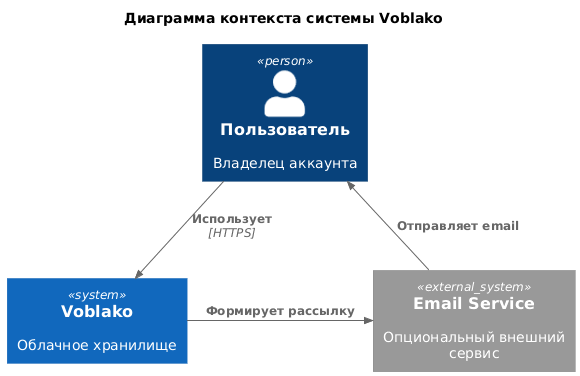
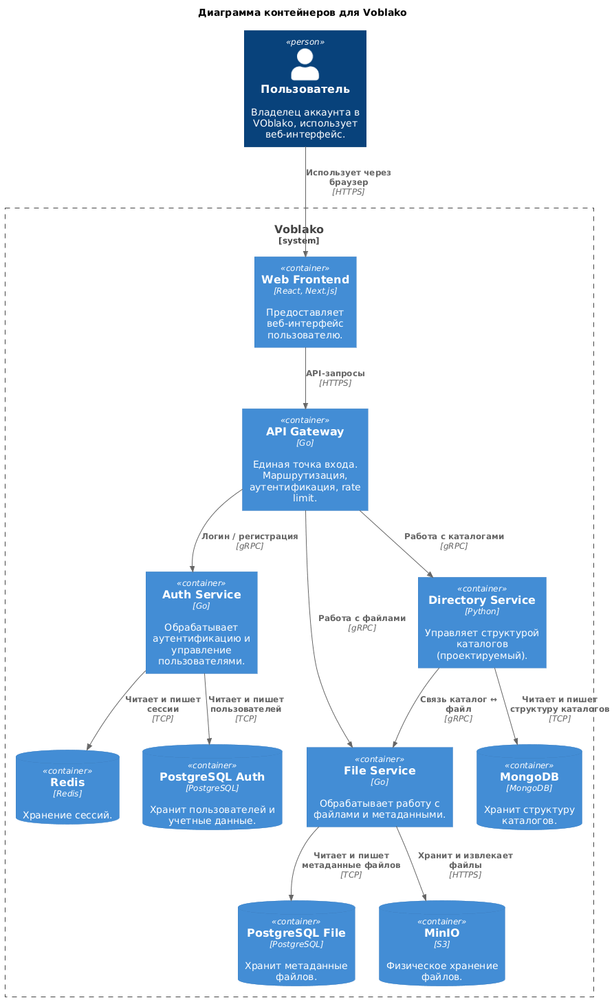
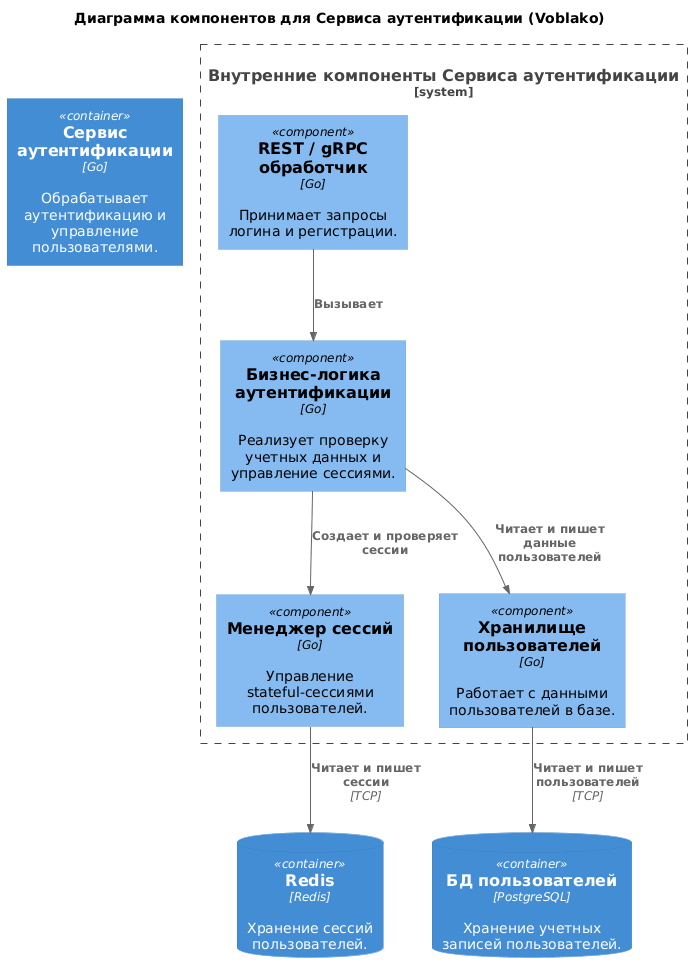
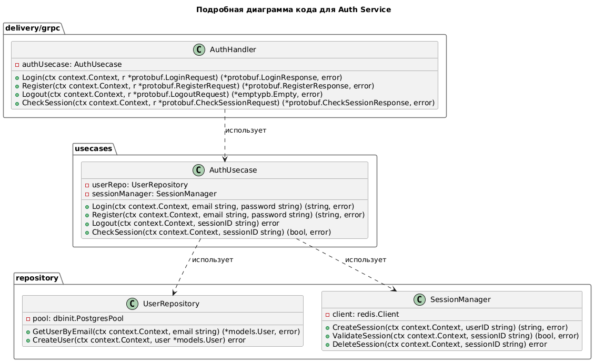

# Сервис аунтификации
Сервис осуществляет аунтификацию пользователей в системе 

## Функциональные требования
1. Работа с пользователями
- регистрация нового пользователя
- получение информации о пользователе
- обновление данных пользователя

2. Аутентификация пользователей

- вход пользователя в систему (логин)
- проверка корректности учётных данных

3. Работа с токенами доступа

- генерация токена доступа
- проверка валидности токена

4. обновление (refresh) токена доступа

- Контроль доступа
- проверка прав доступа пользователя к ресурсам
- идентификация пользователя по токену

## Стек технологий
- Go
- gRPC
- PostgreSQL
- Docker

## Архитектура (модель C4)








## Инструкция по запуску
1. Локальный запуск
```bash
go run cmd/auth_service/main.go
```
2. Запуск в контейнере
```bash
docker compose up -d
```
3. Запуск тестов
```bash
go test ./...
```
