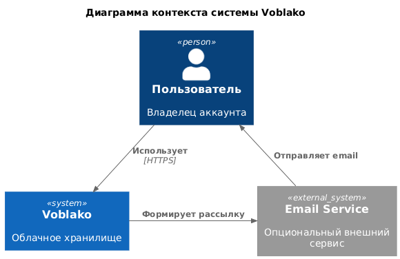
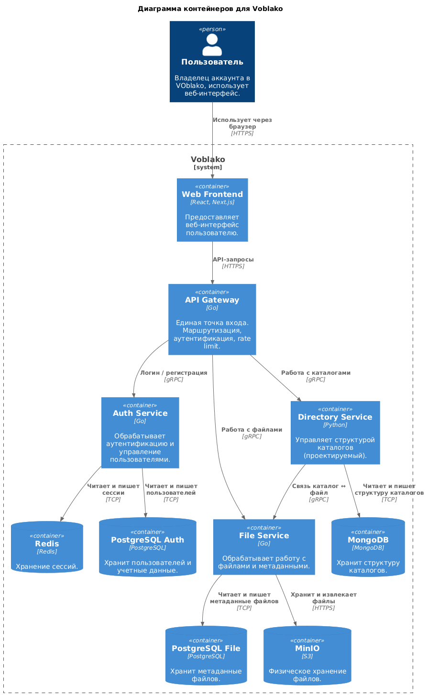
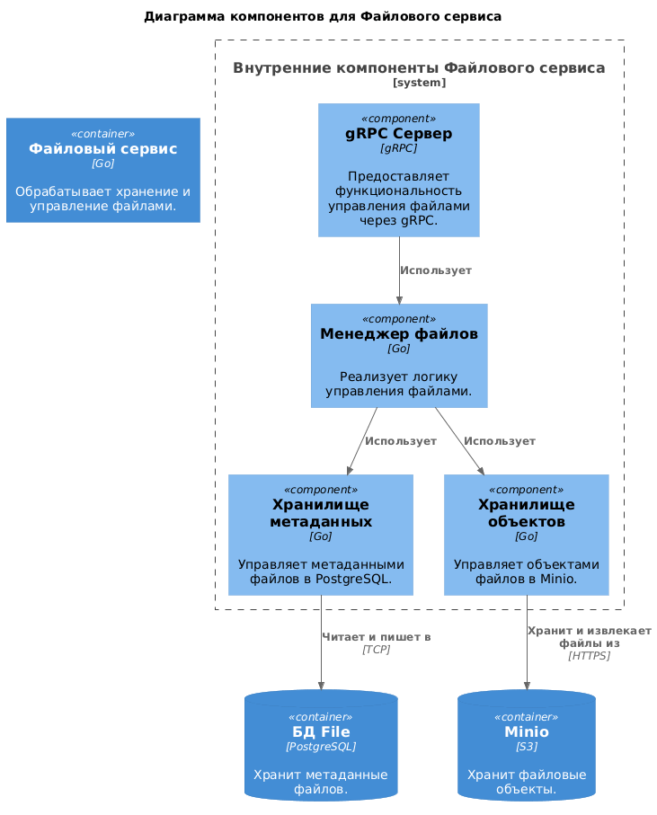

# Файловый сервис
## Функциональные требования
1. Работа с файлами
    - загрузка новых файлов
    - получение файла по id
    - обновление файла
    - удаление файла
2. Работа с метаданными файла: 
    - получение метаданных файла
3. Работа со списком файлов:
    - получение списка файлов для пользователя
4. Работа с именем файла:
    - обновление имени файла

## Стек технологий
- Go
- gRPC
- MinIO
- PostgreSQL
- Docker

## Архитектура (модель C4)
1. Диаграмма контекста

2. Диаграмма контейнеров

3. Диаграмма компонентов

4. Диаграмма кода

## Инструкция по запуску
